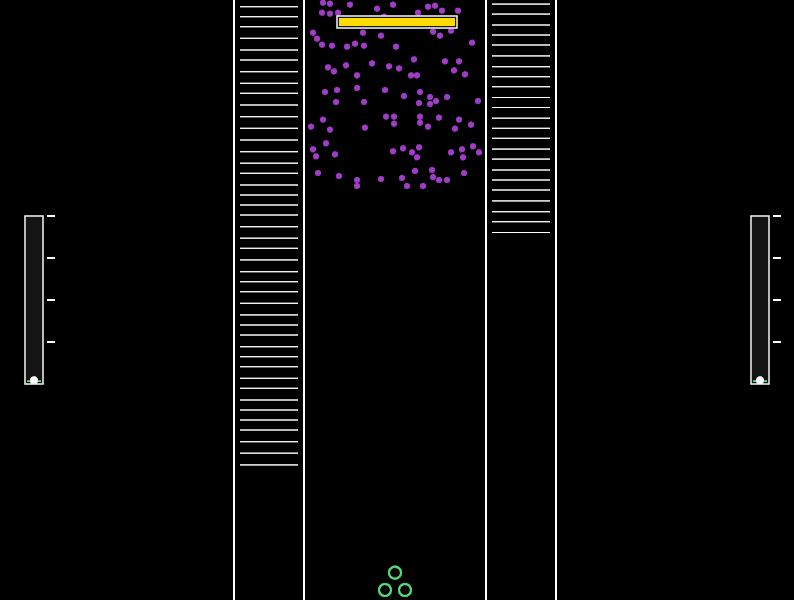

# S-Fight

Tiro vertical em C++ com Allegro 5. A frota fica embaixo da tela e atira para cima, entre três faixas.

A janela é 800×600, a 60 quadros por segundo.

## Como jogar

Você começa com três naves no fundo do corredor do meio. Elas se movem juntas para os lados. Cada nave tem 100 de vida e muda de cor conforme apanha: verde, amarelo e vermelho. Quando a vida chega a zero, a nave some. Sem nenhuma nave, a partida acaba.

O tiro enche sozinho. A barra no topo fica branca enquanto carrega e amarela quando está cheia (cerca de 0,8 s). Quanto mais cheia, mais fechado o leque dos tiros. Com a barra amarela, a frota solta um único tiro grande, reto para cima, em vez da rajada. Disparar esvazia a barra.

Três faixas descem pela tela:

- **Esquerda.** Linhas brancas, mais rápidas. Cada uma aguenta três tiros e vai de branca para amarela e vermelha. A cada 20 linhas destruídas, a barra da esquerda enche e a frota ganha uma nave, até 50. Uma linha que encosta numa nave tira 15 de vida.
- **Meio.** Pontos roxos descem em leva. Um tiro comum destrói um ponto. Se um ponto passa do fundo, uma nave aleatória perde 1 de vida. Se encosta na frota, tira 15 e some. De vez em quando entra a barra amarela, com vida escrita em cima. Tiro comum tira 1; o tiro grande tira 100. Ela para ao tocar a frota e continua tirando 15 de vida por segundo enquanto estiver em cima. Se ela atravessa a tela sem ser parada, a frota inteira morre. Destruí-la acelera a leva roxa.
- **Direita.** As mesmas linhas, mais devagar. A cada 20 destruídas, a barra da direita enche e os tiros ficam mais rápidos.

## Controles

| Tecla | Ação |
| --- | --- |
| A | Move a frota para a esquerda |
| D | Move a frota para a direita |
| Espaço | Dispara |
| R | Reinicia depois do game over |
| Esc | Sai do jogo |

Fechar a janela também encerra.

## Como compilar

Abra `bootstrap_allegro.cbp` no Code::Blocks e compile o alvo Debug ou Release. O projeto liga a Allegro 5.0.10 (MinGW), biblioteca monolith estática. O executável sai em `bin/Debug` ou `bin/Release`.
